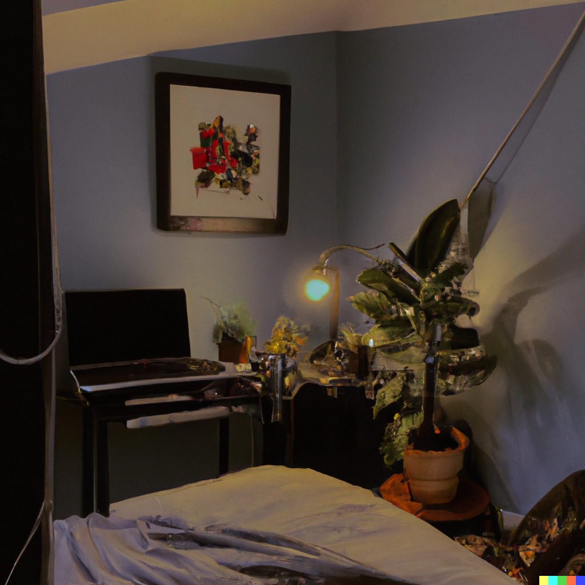

<!-- PROJECT SHIELDS -->
<!--
*** I'm using markdown "reference style" links for readability.
*** Reference links are enclosed in brackets [ ] instead of parentheses ( ).
*** See the bottom of this document for the declaration of the reference variables
*** for contributors-url, forks-url, etc. This is an optional, concise syntax you may use.
*** https://www.markdownguide.org/basic-syntax/#reference-style-links
-->
[![Contributors][contributors-shield]][contributors-url]
[![Forks][forks-shield]][forks-url]
[![Stargazers][stars-shield]][stars-url]
[![Issues][issues-shield]][issues-url]
[![MIT License][license-shield]][license-url]
[![LinkedIn][linkedin-shield]][linkedin-url]

<!-- PROJECT LOGO -->
 

  

<h3 align="center">Little Happy Place For Us</h3>

  

     little happy place where people can escape from the world and just be happy :)
     
    <a href=""><strong>Demo Video Link! »</strong></a>
     
     
    <a href="">Devpost Link</a>
    ·
    <a href="https://github.com/arncv/Little-Happy-Place-For-Us/issues">Report Bug</a>
    ·
    <a href="https://github.com/arncv/Little-Happy-Place-For-Us/issues">Request Feature</a>
  

## Built With

 
 

[![Product Name Screen Shot][product-screenshot]](https://example.com)

## Inspiration
 Due to many technologies and introduction of overly complicated focus timers & music player, I was left overwhelmed.
 
 

## What it does
I then decided to make a minimal & non-overwhelming tool which aids people suffering from ADHD & anxiety to focus & concentrate using a pomodoro timer integrated with lofi music player.

This has a very minimal interface as well as aesthetic look to it.

Everyone is welcome to our little happy place! :) 

## How we built it
 The website was built with HTML5, CSS3 & JavaScript. Along with these, the website was deployed using Github-pages & a custom domain was used.
 Each photo was generated by DALL-E - AI image generator.

(<a href="#readme-top">back to top</a>)

## Challenges we ran into
 The biggest challenge we ran into was the time frame, we had to build the website in 24 hours. We also had to learn how to use Github-pages & how to deploy a website using it.
 
 

## Accomplishments that we're proud of
 The User-Interface of the website is really minimal and non-spammy.
 Perfect for people suffering from ADHD & anxiety. 
 
 

## What we learned
 * How to use Github-pages
 * DALL-E was fun, the logo was generated by an AI :) 
 * sharpened our skills in HTML5, CSS3 & JavaScript.

## What's next for Little Happy Place For Us 
 * Introducing a chatbot to connect with other people
 * Nothing else, it is perfect as it is :)

See the [open issues](https://github.com/arncv/Little-Happy-Place-For-Us/issues) for a full list of proposed features (and known issues).

(<a href="#readme-top">back to top</a>)

<!-- CONTRIBUTING -->
## Contributing

Contributions are what make the open source community such an amazing place to learn, inspire, and create. Any contributions you make are **greatly appreciated**.

If you have a suggestion that would make this better, please fork the repo and create a pull request. You can also simply open an issue with the tag "enhancement".
Don't forget to give the project a star! Thanks again!

1. Fork the Project
2. Create your Feature Branch (`git checkout -b feature/AmazingFeature`)
3. Commit your Changes (`git commit -m 'Add some AmazingFeature'`)
4. Push to the Branch (`git push origin feature/AmazingFeature`)
5. Open a Pull Request

(<a href="#readme-top">back to top</a>)

<!-- LICENSE -->
## License

Distributed under the MIT License. See `LICENSE` for more information.

(<a href="#readme-top">back to top</a>)

<!-- CONTACT -->
## Contact

Arnav Goel  - [@arnvgl](https://twitter.com/arnvgl) - arnvgl@pm.me

Project Link: [https://github.com/arncv/Little-Happy-Place-For-Us](https://github.com/arncv/Little-Happy-Place-For-Us)

(<a href="#readme-top">back to top</a>)

## Our ♥️ Contributors

# FREE & OPEN SOURCE PROJECT - HECK YEAHH!

<!-- MARKDOWN LINKS & IMAGES -->
<!-- https://www.markdownguide.org/basic-syntax/#reference-style-links -->
[contributors-shield]: https://img.shields.io/github/contributors/arncv/Little-Happy-Place-For-Us.svg?style=for-the-badge
[contributors-url]: https://github.com/arncv/Little-Happy-Place-For-Us/graphs/contributors
[forks-shield]: https://img.shields.io/github/forks/arncv/Little-Happy-Place-For-Us.svg?style=for-the-badge
[forks-url]: https://github.com/arncv/Little-Happy-Place-For-Us/network/members
[stars-shield]: https://img.shields.io/github/stars/arncv/Little-Happy-Place-For-Us.svg?style=for-the-badge
[stars-url]:https://github.com/arncv/Little-Happy-Place-For-Us/stargazers
[issues-shield]: https://img.shields.io/github/issues/arncv/Little-Happy-Place-For-Us.svg?style=for-the-badge
[issues-url]: https://github.com/arncv/Little-Happy-Place-For-Us/issues
[license-shield]: https://img.shields.io/github/license/arncv/Little-Happy-Place-For-Us.svg?style=for-the-badge
[license-url]: https://github.com/arncv/Little-Happy-Place-For-Us/blob/master/LICENSE
[linkedin-shield]: https://img.shields.io/badge/-LinkedIn-black.svg?style=for-the-badge&logo=linkedin&colorB=555
[linkedin-url]: https://linkedin.com/in/arnvgl
[product-screenshot]: screenshot.png
